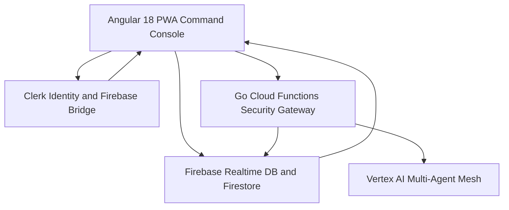

# Sahaay (सहाय) — Smart Humanitarian Resource Allocation

[](https://angular.dev/)
[](https://cloud.google.com/vertex-ai)
[](https://firebase.google.com/)
[](https://clerk.com/)
[](https://developers.google.com/maps)

Sahaay is an offline-capable, mobile-first crisis coordination platform engineered for disaster response and grassroots relief allocation across high-density urban clusters (Mumbai Ward 4 — Dharavi, Kurla, Govandi, Bhandup).

Live Deployment: [sahaay-26007.web.app](https://sahaay-26007.web.app)

---

## Key Capabilities

* **Real-time Crisis Map**: Geospatial crisis heatmap, live need pins, urgency triage, and proximity rings.
* **Vertex AI Multi-Agent Mesh**: 5 specialist reasoning engines powered by Gemini 2.0 for automated matching, predictive surge modeling, donor report narration, and live operational Q&A.
* **Dual-Layer Realtime Sync**: High-throughput Firebase Realtime Database and Cloud Firestore with offline cache for low-connectivity disaster zones.
* **Vision AI Identity Verification**: Automated Aadhaar OCR extraction and facial landmark verification for volunteer and NGO onboarding.
* **Clerk + Firebase Auth Bridge**: Session JWT authentication with custom token minting for fine-grained database access control.
* **Resource Vault**: QR-tracked disaster inventory, supply telemetry, and restock alerts.

---

## AI Multi-Agent Specialist Mesh

All operational AI requests route through a unified reasoning pipeline:

| Agent | Intent | Function |
| :--- | :--- | :--- |
| **OrchestratorAgent** | Intent Routing | Routes operational payloads across specialized agents |
| **MatchAgent** | `MATCH_VOLUNTEERS` | Multi-factor volunteer scoring (Skill 40%, Proximity 30%, Availability 20%, Rating 10%) |
| **SurgeAgent** | `PREDICT_SURGE` | 7-day predictive demand forecasting with seasonal monsoon weighting |
| **NarratorAgent** | `NARRATE_REPORT` | Translates raw ground metrics into CSR donor impact summaries |
| **QueryAgent** | `QUERY_ASSISTANT` | Real-time coordinator intelligence and situational Q&A on active tickets |

---

## Architecture Overview



---

## Role-Based Access Control (RBAC)

* **Field Worker**: Submit ground crisis needs, update task fulfillment, offline mode.
* **Volunteer**: Accept/decline assignments, navigate to crisis locations, report completion.
* **NGO Admin**: Full command center, dispatch volunteers, manage task forces, inventory telemetry.
* **NGO Founder**: Organization setup, NGO registry management, admin controls.
* **Super Admin**: Cross-ward operational oversight, disaster analytics, CSR export.

---

## Quickstart

```bash
# Install dependencies
npm install

# Run local development server
npm start

# Build production bundle
npm run build
```

---

(c) 2026 Sahaay Platform. Mumbai Humanitarian Disaster Response.
